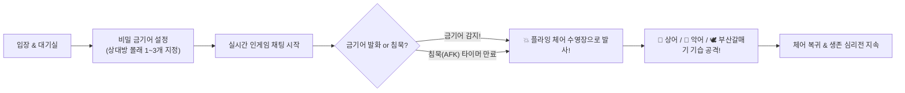

<div align="center">

# 🪑 위험한 초대 : FLYING CHAIR (실시간 웹 멀티플레이어)

> **"네가 그 말을 뱉는 순간, 의자는 뒤로 날아간다!"**  
> 2000년대 전설의 예능 *'위험한 초대'* 플라잉 체어를 웹 소켓 실시간 멀티플레이 게임으로 완벽 복원!  
> 친구의 비밀 금기어를 캐내고, 상어·악어·부산갈매기를 소환하여 끝까지 골탕 먹이세요!

<p align="center">
  <a href="https://github.com/kdh94kor/FLYINGCHAIR/stargazers"></a>
  <a href="https://github.com/kdh94kor/FLYINGCHAIR/network/members"></a>
  <a href="https://github.com/kdh94kor/FLYINGCHAIR/issues"></a>
  <a href="https://github.com/kdh94kor/FLYINGCHAIR/blob/main/LICENSE"></a>
</p>

<p align="center">
  
  
  
  
  
  
</p>

[🎮 지금 바로 플레이하기 (Live Demo)](https://www.flying-chair.com) • [📖 상세 규칙 매뉴얼](https://www.flying-chair.com/guide/rules) • [🧪 아이템 도감](https://www.flying-chair.com/guide/items) • [📊 관리자 대시보드](https://www.flying-chair.com/admin)

</div>

---

## 🌟 Overview (프로젝트 소개)

**FLYING CHAIR**는 과거 일요일 저녁 안방극장을 뜨겁게 달구었던 KBS 예능 *'위험한 초대'*의 **플라잉 체어 & 비밀 금기어 메커니즘**을 웹 표준 기술로 재해석한 **초경량·실시간 심리전 파티 게임**입니다.

- 🚀 **프레임워크 프리 (Zero Framework Dependency)**: React, Vue 등 무거운 프레임워크 없이 순수 Vanilla JS + HTML5 Canvas로 제작되어 **모바일·저사양 기기에서도 60fps**의 압도적인 반응속도를 제공합니다.
- ⚡ **실시간 WebSocket 멀티플레이어**: `Socket.io` 기반의 세션 복구(Session Recovery) 기술을 적용하여 모바일 백그라운드 전환이나 순간적인 네트워크 끊김에도 끊김 없는 플레이를 보장합니다.
- 🧠 **단일 진실 공급원 (PlayerState SSOT)**: 상태 머신(State Machine)을 통해 착석(Seated), 공중 비행(Flying), 물속 허우적(Pool), 동물 제압(Caught), 미사일 기절(Stunned) 상태를 엄격히 검증하여 버그 없는 판정을 구현했습니다.
- 📈 **지능형 금기어 데이터 파이프라인**: 실제 유저들이 입력한 금기어를 Supabase DB와 Write-Behind 인메모리 캐시로 실시간 집계하여 **TOP 100 랭킹 및 슬롯머신 추천 알고리즘**을 지원합니다.

---

## 🎯 Key Game Mechanics (핵심 게임 규칙)



### 1. 🤫 비밀 금기어 심리전
- 방 생성 시 1인당 1~3개의 금기어를 지정합니다.
- 상대방은 자신이 어떤 금기어를 받았는지 **전혀 모른 채** 대화를 시작합니다.
- 상대의 질문을 유도하여 상대가 자신의 금기어를 말하게 만들면, 해당 플레이어의 의자가 시원하게 물속으로 발사됩니다!

### 2. ⏰ 침묵 방지(AFK) 강제 발사 타이머
- 말을 하지 않고 눈치만 보는 행위를 방지하기 위해 **실시간 침묵 감지 타이머**가 가동됩니다.
- 제한 시간(기본 30~60초) 동안 한마디도 채팅을 치지 않으면 경고 후 **즉시 강제 사출**됩니다.

---

## 🎒 Special Item Encyclopedia (8종 특수 전략 아이템)

게임 중 주기적으로 하늘에서 공중 보급품 상자가 투하됩니다. 상황에 맞게 사용하여 전세를 역전시키세요!

| 아이템 | 이름 | 희귀도 | 효과 및 전략 설명 |
| :---: | :--- | :---: | :--- |
| 🚀 | **유도 미사일** | `Rare` | **착석 중인 타깃 1명을 격추하여 30초간 기절**시킵니다. (비행 중 명중 시 착지 즉시 기절 누적 발동) |
| 🛡️ | **방어 방패** | `Common` | 날아오는 **미사일 공격을 1회 완벽하게 방어**하고 소멸합니다. |
| 🃏 | **금기어 변경권** | `Epic` | 상대방의 금기어 중 1개를 내가 원하는 **새로운 비밀 금기어로 교체**합니다. |
| ➕ | **금기어 추가권** | `Epic` | 모든 상대방에게 **비밀 금기어를 1개씩 추가**하여 트랩을 촘촘하게 만듭니다. |
| ✂️ | **금기어 삭제권** | `Rare` | 내게 걸려있는 치명적인 **금기어 중 무작위 1개를 즉시 파기**합니다. |
| 🦈 | **식인 상어 소환** | `Legendary` | 수영장에 식인 상어를 풀어, **물에 빠진 희생자를 물속에서 30초간 공격(기절)**합니다. |
| 🐊 | **늪지 악어 소환** | `Legendary` | 수영장 얕은 물가에 악어를 대기시켜, **낙하한 희생자를 30초간 물고 제압**합니다. |
| 🕊️ | **부산갈매기 소환** | `Mythic` | 상공을 고속 선회하다가 **날아오르는 순간 공중 낚아채기 납치! 1분간 채팅 금지** 페널티를 부여합니다. |

---

## 🏛️ System Architecture (시스템 구조)

```
┌────────────────────────────────────────────────────────────────────────┐
│                              CLIENT TIER                               │
│   Vanilla JS (HTML5 Canvas + DOM)  •  Mobile Viewport Auto-Padding      │
│   Pretendard Design System  •  PlayerState Client Mirror               │
└───────────────────▲────────────────────────────────▲───────────────────┘
                    │                                │
            (Static Assets)                     (WebSockets / API)
                    │                                │
┌───────────────────┴───────────────┐  ┌─────────────┴───────────────────┐
│           VERCEL EDGE             │  │         RENDER CONTAINER        │
│   • Global CDN Static Hosting     │  │   • Node.js / Express Server    │
│   • Clean URLs & Rewrite Routing  │  │   • Socket.io Room / State Hub  │
│   • SEO Metadata & OpenGraph      │  │   • Rate Limiting & Helmet Guard│
└───────────────────────────────────┘  └─────────────┬───────────────────┘
                                                     │
                                       (Write-Behind Cache / DB Sync)
                                                     │
                                       ┌─────────────▼───────────────────┐
                                       │        SUPABASE CLOUD           │
                                       │   • PostgreSQL Database         │
                                       │   • Atomic Word Counter RPC     │
                                       │   • Traffic & Session Analytics │
                                       └─────────────────────────────────┘
```

### 💎 Key Architectural Highlights
1. **SSOT (Single Source of Truth) 플레이어 상태 관리**:
   - `PlayerState.STATUS` (`IDLE`, `FLYING`, `DEAD_WATER`, `DEAD_GATOR`, `DEAD_SHARK`, `DEAD_GULL`, `DEAD_MISSILE`)
   - 상태 머신을 통하여 미사일 조준 가능 여부(`canBeTargetedByMissile`), 아이템 사용 가능 여부(`canUseActionItems`)를 단일 함수로 제어합니다.
2. **Write-Behind 금기어 집계 엔진**:
   - 인게임에서 쏟아지는 단어 등록 트래픽을 인메모리 델타(`pendingDeltas`)에 즉시 기록(0ms 지연)한 뒤, 디바운스 및 배치 동기화 프로시저(`increment_taboo_words`)를 통해 PostgreSQL로 안전하게 영구 저장합니다.
3. **독립 블라인드 에이전트(Blind Subagent) QA 파이프라인**:
   - 모든 기능 구현 및 수정 시, 사전 지식이 없는 독립된 테스트 에이전트가 5종 이상의 블랙박스/회귀 검증을 완벽히 통과할 때만 프로덕션 배포(`origin main`)를 승인하는 무결점 개발 문화를 준수합니다.

---

## 📁 Directory Structure (프로젝트 구조)

```bash
flyingchair/
├── data/
│   └── taboo_words.json         # 로컬 백업 금기어 100선 프리셋
├── public/                      # Vercel 정적 배포 미러 (100% SSOT 동기화)
│   ├── guide/
│   │   ├── items.html           # 8종 아이템 도감 & 밸런스 매트릭스 상세 페이지
│   │   ├── rules.html           # 게임 매뉴얼 & 규칙 가이드
│   │   └── strategy.html        # 고수들의 심리전 공략 & 필승 팁
│   ├── admin.html               # 관리자 트래픽 & 금기어 랭킹 대시보드
│   ├── faq.html                 # 자주 묻는 질문 (FAQ)
│   ├── index.html               # 게임 메인 로비 & 인게임 캔버스
│   ├── privacy.html             # 개인정보처리방침
│   ├── robots.txt               # 검색엔진 최적화 크롤러 설정
│   ├── sitemap.xml              # 사이트맵
│   └── terms.html               # 서비스 이용약관
├── src/
│   ├── playerState.js           # 플레이어 상태 머신 SSOT 코어 모듈
│   ├── statsManager.js          # 시계열 트래픽 및 세션 분석 매니저
│   ├── supabaseClient.js        # Supabase 클라이언트 연결 모듈
│   └── tabooWordsManager.js     # 금기어 실시간 집계 & Write-Behind 캐시
├── admin.html                   # 루트 관리자 대시보드
├── index.html                   # 루트 게임 메인 캔버스
├── server.js                    # Express + Socket.io 게임 메인 백엔드
├── vercel.json                  # Vercel 라우팅 리라이트 & 프록시 설정
├── package.json                 # 프로젝트 의존성 명세
└── GEMINI.md                    # 프로젝트 아키텍처 규칙 & QA 가이드라인
```

---

## 🛠️ Quick Start (로컬 실행 가이드)

### 1. 레포지토리 클론
```bash
git clone https://github.com/kdh94kor/FLYINGCHAIR.git
cd FLYINGCHAIR
```

### 2. 의존성 설치
```bash
npm install
```

### 3. 환경 변수 설정 (`.env`)
프로젝트 루트 경로에 `.env` 파일을 생성하고 다음 정보를 입력합니다:
```env
PORT=3000
ADMIN_USER=admin
ADMIN_PASSWORD=your_secure_password
SUPABASE_URL=https://your-project.supabase.co
SUPABASE_KEY=your-supabase-key
```

### 4. 개발 서버 기동
```bash
# 개발 모드 (Nodemon 감지)
npm run dev

# 프로덕션 모드
npm start
```
브라우저에서 `http://localhost:3000`으로 접속하여 즉시 플레이할 수 있습니다.

---

## 🧪 Testing & Verification (테스트 실행)

프로젝트에 포함된 독립 테스트 스위트를 통해 게임 시스템의 무결성을 즉시 검증할 수 있습니다:

```bash
# 1. 봇 모드 배제 및 순수 유저 금기어 선별 집계 검증
node scratch/test_exclude_bot_taboo_words.js

# 2. 금기어 라이프사이클 (시작, 추가권, 변경권) 저장 검증
node scratch/test_taboo_lifecycle_recording.js

# 3. 관리자 통계, 검색, 정렬 및 CSV 내보내기 검증
node scratch/test_admin_taboo_words.js

# 4. PlayerState SSOT 상태 머신 검증
node scratch/test_player_state_ssot.js

# 5. 착석자 대상 미사일 조준 및 상태 격리 검증
node scratch/test_missile_targeting_seated_only.js
```

---

## 📊 Admin Dashboard (관리자 대시보드)

URL: `/admin` (HTTP Basic Auth 인증 필요)

- 📈 **트래픽 분석**: 일자별/요일별/시간대별 접속자 수, 게임 진행 수, 평균 참여 인원 분석 차트 제공 (Chart.js)
- 🔥 **실시간 금기어 랭킹**: 유저들이 가장 많이 설정한 금기어 순위(1~100위), 카운트, 점유율, 글자 수 분석 및 UTF-8 BOM CSV 내보내기 지원

---

## 🤝 Contributing & Community

기여는 언제나 환영합니다! 새로운 아이템 아이디어, 애니메이션 개선, 버그 리포트는 Issue 및 Pull Request로 남겨주세요.

1. Fork the Project (`gh repo fork kdh94kor/FLYINGCHAIR`)
2. Create your Feature Branch (`git checkout -b feat/AmazingFeature`)
3. Commit your Changes (`git commit -m 'feat: Add AmazingFeature'`)
4. Push to the Branch (`git push origin feat/AmazingFeature`)
5. Open a Pull Request

---

## 📜 License

This project is licensed under the **MIT License** - see the [LICENSE](LICENSE) file for details.

---

<div align="center">

**Made with 💙 and endless flying chairs.**  
Crafted by [@kdh94kor](https://github.com/kdh94kor)

</div>